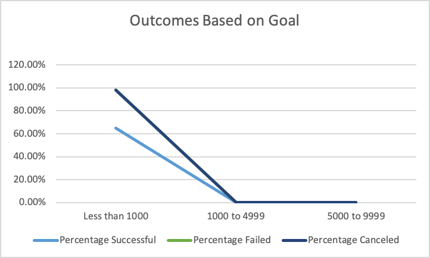
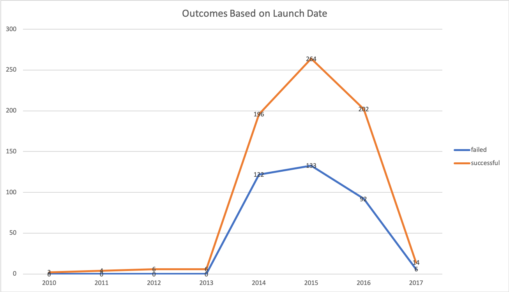

### Challenge
## Outcomes Based on Goal

- When the number of Kickstarters is less than 1000 we have around a 60% success rate that eventually trends down to 0 when we get to 5000.
- Since we only had one legitimate row of data to work with (our total plays/projects was just above 1000) we don't have much data for the percentage of how many plays were canceld so that data may be incomplete. 

- 2015 was the most successful year for plays with over 264 successful launches.
- Between 2010 and 2013 there was only a small number of plays launched/canceled.