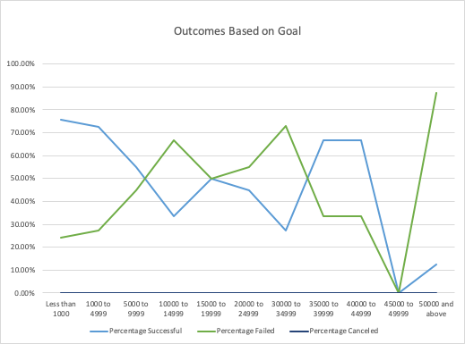

### Challenge
## Outcomes Based on Goal

- When the cost of Kickstarters is less than $1000 we have a fairly high success rate (almost 80%)
- The success and failure rate of Kickstarters is even at 50% when the Kickstarter value is between $15000 to $19999.
- Almost 90% of Kickstarters above $50000 fail

- 2015 was the most successful year for plays with over 264 successful launches.
- Between 2010 and 2013 there was only a small number of plays launched/canceled.